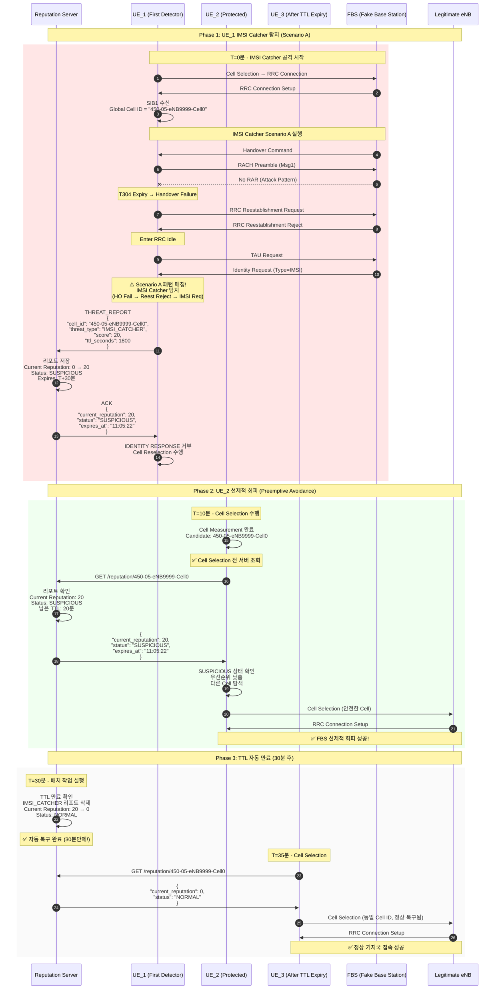

# 위협 시나리오 기반 가변 TTL 평판 시스템을 이용한 가짜 기지국(FBS) 선제적 회피 방법

**Preemptive FBS Avoidance Method using Threat Scenario-based Adaptive TTL Reputation System**

---

## 특허 핵심 개념

**"선제적 회피 (Preemptive Avoidance) + 시나리오 기반 탐지 + Adaptive TTL + SMC 무결성 검증"**

**핵심 차별점**:

1. **선제적 회피 (Preemptive Avoidance)** ⭐ 핵심 방법론
   - **"서버 정보를 활용해 연결 시도조차 하지 않고 회피"**
   - Cell Selection 전 평판 조회 → FBS 접속 자체를 원천 차단
   - **Identity Request 받기 전 회피** → IMSI 탈취 불가능
   - 기존: "탐지 후 대응" → 본 특허: "탐지 전 회피"

2. **IMSI 탈취 방지 및 개인정보 보호**
   - FBS가 Identity Request를 보낼 기회 자체를 제거
   - IMSI, IMEI, 위치 정보 등 **모든 개인정보 노출 원천 차단**
   - 기존 방식 대비 **압도적인 프라이버시 보호 우위**

3. **회피와 복구의 균형 (Avoidance + Resilience)**
   - **회피**: 철저한 사전 차단으로 보안 강화
   - **복구**: 시간 단위 TTL (30분~6시간)로 빠른 서비스 복구
   - **대조적 개념의 조화**: "막으면서도 빠르게 복구"하는 완성도

4. **SMC 무결성 검증**: 암호키 없이 생성 불가능한 Security Mode Complete를 신뢰 증명으로 사용 (Replay Attack 방어)

5. **Exponential Back-off TTL**: 반복 공격 시 TTL 기하급수적 증가 (APT 대응)

---

## 1. 시스템 개요

### 1.1 핵심 아이디어

**FBS(Fake Base Station) 접속 전 평판을 조회하여 악성 기지국을 선제적으로 회피**하는 협업 방어 시스템

**문제 인식 및 해결책**:

**기존 방식의 근본적 한계** (Reactive Detection):
- FBS에 **이미 접속한 후** 탐지 (Identity Request 직전)
- IMSI 요구 직전이므로 **이미 늦음**
- RRC Connection이 이미 성립된 상태 → IMSI, IMEI 등 개인정보 노출 위험
- "찾았다"에서 끝나는 수동적 대응

**본 특허의 혁신** (Preemptive Avoidance):
- **Cell Selection 전 평판 조회** → "서버 정보를 활용해 연결 시도조차 하지 않고 회피"
- FBS 접속 자체를 차단 → **Identity Request 받을 기회 자체를 제거**
- **IMSI 탈취 원천 방지** → 압도적인 개인정보 보호 우위
- "막으면서도 빠르게 복구"하는 완성도 (Avoidance + Resilience)

#### 주요 특징

1. **시나리오 기반 탐지 (Scenario-Based Detection)**
   - IMSI Catcher, Null Cipher 등 **사전 정의된 위협 Flow**를 패턴 매칭
   - 새로운 공격 발견 시 **시나리오를 추가**하여 모든 UE에 배포

2. **위협별 차등 점수 및 가변 TTL (Adaptive TTL Policy Engine)**
   - IMSI Catcher (20점): 짧은 TTL (**30분~1시간**)
   - Null Cipher (50점): 긴 TTL (**2시간~6시간**)
   - **Exponential Back-off**: 동일 Cell ID 반복 공격 시 TTL 기하급수적 증가 (2배, 4배, 8배...)
   - **APT 대응**: 지능형 지속 위협에 자동 대응

3. **선제적 회피 (Preemptive Avoidance)**
   - **모든 Cell Selection 전** Reputation Server 조회
   - 특정 점수 이상 Cell은 **선택 대상에서 즉시 제외**

4. **회복 탄력성 (Resilience)**
   - TTL이 '일(Day)' 단위가 아닌 **'시간(Hour)' 단위**
   - FBS 제거 후 **별도 조치 없이 자동 복구**

5. **SMC 무결성 검증 기반 강제 초기화 (SMC-based Force Reset)**
   - 단순 Auth Response가 아닌 **Security Mode Complete 성공** 시점에 복구
   - **암호키 없이 생성 불가능한 SMC**를 신뢰 증명으로 사용
   - **Replay Attack 원천 차단** (FBS는 Core Network 암호키 없어 SMC 생성 불가)
   - TTL 만료 대기 불필요

---

## 2. 위협 시나리오 데이터베이스 (Threat Scenario Database)

### 2.1 개념

**동작 원리**:
- 새로운 FBS 공격 패턴 발견 → 위협 시나리오 정의 → Reputation Server 업데이트 → 모든 UE 보호

**확장 가능한 구조**:
- 사전 정의된 시나리오 DB에 새로운 공격 패턴을 지속적으로 추가
- OTA(Over-The-Air) 업데이트로 모든 UE에 배포

### 2.2 위협 시나리오 정의

각 위협은 **고유한 Flow 패턴**으로 정의됨:

#### Scenario A: IMSI Catcher
```
패턴:
  Handover Failure (T304 Expiry)
  → RRC Reestablishment Reject
  → RRC Idle 진입
  → TAU Request
  → Identity Request (Type = IMSI)

탐지 조건:
  - 모든 이벤트가 60초 이내 발생
  - Identity Request Type이 IMSI인 경우

점수: 20점
TTL: 30분~1시간
```

#### Scenario B: Null Cipher
```
패턴:
  GNSS 위치 측위 → Country Code 획득
  → ATTACH REQUEST
  → AUTHENTICATION REQUEST/RESPONSE
  → SECURITY MODE COMMAND (EEA0 or EIA0)
  → Country별 Null Cipher 정책 확인

탐지 조건:
  - GNSS 기반 현재 국가 확인 (Geocoding)
  - 해당 국가/사업자의 Null Cipher 정책 확인
  - 정책: Null Cipher 미사용 국가인 경우
  - UE가 EEA1/EEA2 지원
  - Network가 EEA0/EIA0 선택
  - Downgrade Attack 확정

점수: 50점
TTL: 2시간~6시간
```

### 2.3 시나리오 확장성

새로운 공격 패턴 추가 예시:

#### Scenario C: Bidding Down Attack (미래 추가 가능)
```
패턴:
  5G NR 접속 중
  → RRC Release with Redirection (Target: 4G LTE)
  → 5G 신호 강도: RSRP > -90dBm (충분히 강함)
  → Redirection Cause: Load Balancing (의심스러움)

탐지 조건:
  - 5G 신호가 충분히 강한 상태에서 4G로 강제 이동
  - 정당한 이유 없음

점수: 30점
TTL: 1시간~2시간
```

---

## 3. Reputation Server 구조

### 3.1 데이터 스키마

```json
{
  "cell_id": "450-05-eNB9999-Cell0",
  "reports": [
    {
      "report_id": "r-2026011710-a3f5c2",
      "threat_type": "IMSI_CATCHER",
      "score": 20,
      "timestamp": "2026-01-17T10:35:22Z",
      "ttl_seconds": 1800,
      "expires_at": "2026-01-17T11:05:22Z",
      "ue_id_hash": "a3f5c2..."
    },
    {
      "report_id": "r-2026011711-b7e9d1",
      "threat_type": "NULL_CIPHER",
      "score": 50,
      "timestamp": "2026-01-17T11:20:15Z",
      "ttl_seconds": 7200,
      "expires_at": "2026-01-17T13:20:15Z",
      "ue_id_hash": "b7e9d1..."
    }
  ],
  "current_reputation": 70,
  "status": "BARRING",
  "last_query": "2026-01-17T12:00:00Z",
  "total_queries": 42
}
```

### 3.2 TTL 정책 (시간 단위)

| 위협 유형 | 점수 | TTL (시간) | TTL (초) | 근거 |
|---------|------|----------|---------|------|
| **NULL_CIPHER** | 50 | **2~6시간** | 7200~21600 | 매우 치명적, 긴 보호 기간 필요 |
| **BIDDING_DOWN** | 30 | **1~2시간** | 3600~7200 | 중간 위협 |
| **IMSI_CATCHER** | 20 | **30분~1시간** | 1800~3600 | 상대적으로 낮은 위협, 빠른 회복 |
| **AKA_SUCCESS** | 0 | **즉시 초기화** | 0 | 정상 복구 |

### 3.3 Status 임계값

| Current Reputation | Status | 조치 |
|-------------------|--------|------|
| **0~19** | NORMAL | 정상 접속 허용 |
| **20~49** | SUSPICIOUS | 우선순위 낮춤 (접속 가능) |
| **50+** | BARRING | **Cell Selection에서 완전 제외** |

### 3.4 점수 계산 (단순 합산)

```python
def calculate_current_reputation(cell_id):
    now = datetime.now()
    valid_reports = [r for r in cell.reports if r.expires_at > now]
    return min(100, sum(r.score for r in valid_reports))
```

---

## 4. Mermaid Sequence Diagram - Scenario A: IMSI Catcher (Short-TTL)



---

## 5. Mermaid Sequence Diagram - Scenario B: Null Cipher + AKA Reset

```mermaid
sequenceDiagram
    autonumber
    participant RS as Reputation Server
    participant GNSS as GNSS/GPS
    participant UE1 as UE_1
    participant UE2 as UE_2
    participant FBS as FBS
    participant LegitBS as Legitimate eNB
    participant CN as Core Network

    Note over RS,CN: Phase 1: NULL_CIPHER 탐지 (2시간 TTL)

    rect rgb(255, 220, 220)
    Note over UE1,FBS: T=0분 - Null Cipher 공격

    UE1->>GNSS: Location Request<br/>(Country Code 확인 요청)
    GNSS->>GNSS: 위치 측위 (Position Measurement)<br/>+ Geocoding 작업
    GNSS->>UE1: Country Code 응답<br/>(예: KR - South Korea)

    Note over UE1: Country별 Null Cipher 정책 확인<br/>KR: Null Cipher 미사용 국가 ✅

    UE1->>FBS: ATTACH REQUEST
    FBS->>UE1: AUTHENTICATION REQUEST
    UE1->>FBS: AUTHENTICATION RESPONSE
    FBS->>UE1: SECURITY MODE COMMAND<br/>⚠️ EEA0/EIA0 (Null Cipher)

    Note over UE1: ⚠️ Scenario B 패턴 매칭!<br/>• GNSS Country: KR (Null Cipher 금지)<br/>• UE Capability: EEA2 지원<br/>• Network Command: EEA0 선택<br/>→ Downgrade Attack 확정!

    UE1->>RS: THREAT_REPORT<br/>{<br/>"cell_id": "450-05-eNB8888-Cell1",<br/>"threat_type": "NULL_CIPHER",<br/>"score": 50,<br/>"ttl_seconds": 7200<br/>}

    RS->>RS: 리포트 저장<br/>Current Reputation: 0 → 50<br/>Status: BARRING<br/>Expires: T+2시간

    RS->>UE1: ACK<br/>{<br/>"current_reputation": 50,<br/>"status": "BARRING",<br/>"expires_at": "12:00:00"<br/>}

    UE1->>FBS: SECURITY MODE REJECT
    UE1->>UE1: Cell Reselection
    end

    Note over RS,CN: Phase 2: UE_2 선제적 회피

    rect rgb(255, 245, 230)
    Note over UE2: T=10분 - Cell Selection

    UE2->>RS: GET /reputation/450-05-eNB8888-Cell1

    RS->>UE2: {<br/>"current_reputation": 50,<br/>"status": "BARRING"<br/>}

    UE2->>UE2: ⛔ BARRING 상태!<br/>Cell Selection에서 완전 제외

    UE2->>LegitBS: 다른 Cell 선택
    LegitBS->>UE2: RRC Connection Setup

    Note over UE2,LegitBS: ✅ NULL_CIPHER Cell 완전 차단
    end

    Note over RS,CN: Phase 3: FBS 제거 + AKA 기반 강제 초기화

    rect rgb(240, 255, 240)
    Note over FBS: T=30분 - FBS 제거됨 (공격자 이동)

    Note over LegitBS: 동일 Cell ID로<br/>정상 기지국 재가동

    Note over UE1: T=35분 - Cell Selection

    UE1->>RS: GET /reputation/450-05-eNB8888-Cell1

    RS->>RS: TTL 아직 남음 (1시간 30분)<br/>Current Reputation: 50<br/>Status: BARRING

    RS->>UE1: {<br/>"current_reputation": 50,<br/>"status": "BARRING"<br/>}

    UE1->>UE1: BARRING 상태 확인<br/>다른 Cell 선택 시도

    Note over UE1: 하지만 다른 Cell 없음<br/>긴급 상황

    UE1->>LegitBS: 강제 접속 시도 (Emergency)
    LegitBS->>UE1: RRC Connection Setup

    LegitBS->>CN: AUTHENTICATION REQUEST
    CN->>LegitBS: AUTHENTICATION REQUEST (Valid AUTN)
    LegitBS->>UE1: AUTHENTICATION REQUEST
    UE1->>UE1: AUTN 검증 성공

    UE1->>LegitBS: AUTHENTICATION RESPONSE
    Note over UE1: ⚠️ AUTH RESPONSE는<br/>Replay Attack 가능<br/>(아직 정상 기지국 확정 아님)

    LegitBS->>CN: Forward Response
    CN->>CN: RES = XRES ✅

    CN->>LegitBS: SECURITY MODE COMMAND (EEA2/EIA2)
    LegitBS->>UE1: SECURITY MODE COMMAND (EEA2/EIA2)
    Note over UE1: Security Mode Command 수신!<br/>• Country: KR (Null Cipher 금지)<br/>• Network: EEA2 선택<br/>→ FBS는 불가능한 절차

    UE1->>LegitBS: SECURITY MODE COMPLETE

    Note over UE1: ✅ AKA 성공 + 정상 기지국 확정!<br/>Security Mode Complete까지 완료

    UE1->>RS: AKA_SUCCESS_REPORT<br/>{<br/>"cell_id": "450-05-eNB8888-Cell1",<br/>"event_type": "AKA_SUCCESS",<br/>"score": 0,<br/>"force_reset": true<br/>}

    RS->>RS: 강제 초기화!<br/>모든 리포트 즉시 삭제<br/>Current Reputation: 50 → 0<br/>Status: NORMAL

    RS->>UE1: ACK<br/>{<br/>"current_reputation": 0,<br/>"status": "NORMAL",<br/>"reset_reason": "AKA_SUCCESS"<br/>}

    Note over RS: ✅ TTL 만료 전 강제 복구!<br/>(2시간 대기 불필요)
    end

    Note over RS,CN: Phase 4: 다른 UE들도 즉시 접속 가능

    rect rgb(240, 255, 240)
    Note over UE2: T=40분 - Cell Selection

    UE2->>RS: GET /reputation/450-05-eNB8888-Cell1

    RS->>UE2: {<br/>"current_reputation": 0,<br/>"status": "NORMAL"<br/>}

    UE2->>LegitBS: Cell Selection (정상 복구된 Cell)
    LegitBS->>UE2: RRC Connection Setup

    Note over UE2,LegitBS: ✅ 모든 UE 정상 서비스 재개
    end
```



---

## 6. Trust Server API 스펙

### 6.1 THREAT_REPORT (POST)

**Endpoint**: `POST /api/v2/threat-report`

**Request**:
```json
{
  "cell_id": "450-05-eNB9999-Cell0",
  "threat_type": "IMSI_CATCHER",
  "score": 20,
  "ttl_seconds": 1800,
  "evidence": {
    "handover_failure": true,
    "reestablishment_reject": true,
    "identity_request_type": "IMSI",
    "timestamp_ho_failure": "2026-01-17T10:35:15Z",
    "timestamp_identity_req": "2026-01-17T10:35:20Z",
    "pattern_match_duration_ms": 5000
  },
  "ue_id_hash": "a3f5c2e8d1b4...",
  "timestamp": "2026-01-17T10:35:22Z"
}
```

**Response**:
```json
{
  "report_id": "r-2026011710-a3f5c2",
  "cell_id": "450-05-eNB9999-Cell0",
  "current_reputation": 20,
  "status": "SUSPICIOUS",
  "expires_at": "2026-01-17T11:05:22Z",
  "ttl_remaining_seconds": 1800
}
```

### 6.2 AKA_SUCCESS_REPORT (POST)

**Endpoint**: `POST /api/v2/aka-success-report`

**Request**:
```json
{
  "cell_id": "450-05-eNB8888-Cell1",
  "event_type": "AKA_SUCCESS",
  "score": 0,
  "force_reset": true,
  "evidence": {
    "authentication_success": true,
    "autn_verified": true,
    "encryption_algo": "EEA2",
    "integrity_algo": "EIA2",
    "security_mode_complete": true
  },
  "timestamp": "2026-01-17T11:35:00Z"
}
```

**Response**:
```json
{
  "cell_id": "450-05-eNB8888-Cell1",
  "current_reputation": 0,
  "status": "NORMAL",
  "reset_reason": "AKA_SUCCESS",
  "previous_reputation": 50,
  "cleared_reports": 2
}
```

### 6.3 GET REPUTATION (GET)

**Endpoint**: `GET /api/v2/reputation/{cell_id}`

**Response**:
```json
{
  "cell_id": "450-05-eNB9999-Cell0",
  "current_reputation": 20,
  "status": "SUSPICIOUS",
  "active_reports": [
    {
      "threat_type": "IMSI_CATCHER",
      "score": 20,
      "expires_at": "2026-01-17T11:05:22Z",
      "ttl_remaining_seconds": 1200
    }
  ],
  "total_queries": 42,
  "last_report_time": "2026-01-17T10:35:22Z"
}
```

---

## 7. 위협 시나리오 업데이트 메커니즘

### 7.1 새로운 위협 추가 절차

1. **위협 발견**: 보안 연구진이 새로운 FBS 공격 패턴 발견
2. **시나리오 정의**: 공격 Flow를 단계별로 분석
3. **점수 및 TTL 결정**: 위협 심각도에 따라 점수와 TTL 할당
4. **서버 배포**: Reputation Server에 새 시나리오 등록
5. **UE 업데이트**: OTA로 새로운 탐지 로직 배포

### 7.2 예시: 새 시나리오 추가

```json
{
  "scenario_id": "SCENARIO_D",
  "name": "BIDDING_DOWN_ATTACK",
  "version": "1.0",
  "pattern": {
    "events": [
      {"type": "RRC_RELEASE", "target_rat": "LTE", "cause": "LOAD_BALANCING"},
      {"type": "SIGNAL_STRENGTH_CHECK", "current_rat": "5G_NR", "rsrp_threshold": -90}
    ],
    "timeout_seconds": 60
  },
  "scoring": {
    "score": 30,
    "ttl_seconds": 5400
  },
  "status_mapping": {
    "30": "SUSPICIOUS"
  }
}
```

---

## 8. 특허 핵심 포인트

### 8.1 시나리오 기반 위협 탐지 (Scenario-Based Threat Detection)

**기존 기술**:
- 정적인 단일 패턴 탐지
- 새로운 공격에 대응 불가

**본 특허**:
- **동적 업데이트 가능한 시나리오 DB**
- 새로운 공격 발견 시 즉시 배포
- **확장 가능한 아키텍처** (Scenario A, B, C, D...)

### 8.2 가변적 TTL 정책 엔진 (Adaptive TTL Policy Engine)

**기존 문제**:
- 일(Day) 단위 고정 TTL → 복구 느림
- FBS 제거 후에도 수 일간 차단
- 지속적 공격에 대한 대응 부족

**본 특허의 이중 전략**:

#### (1) 시간 단위 Short-TTL (Hour-based TTL)
- **시간 단위 TTL** (30분~6시간)
- FBS 제거 후 **빠른 자동 복구**
- 서비스 가용성 향상

**비교**:
| 항목 | 기존 (Day-based) | 본 특허 (Hour-based) |
|------|----------------|-------------------|
| IMSI Catcher TTL | 3일 (72시간) | **30분~1시간** |
| Null Cipher TTL | 7일 (168시간) | **2~6시간** |
| 복구 소요 시간 | 수 일 | **수십 분** |

#### (2) Exponential Back-off 정책 (APT 대응)

**핵심 아이디어**:
- 단순히 시간만 재는 것이 아님
- **동일 Cell ID에서 위협 리포트 반복 시 TTL 기하급수적 증가**
- 지능형 지속 위협(APT: Advanced Persistent Threat) 대응

**동작 원리**:
```python
def calculate_adaptive_ttl(cell_id, threat_type, base_ttl):
    repeat_count = get_repeat_count(cell_id, threat_type)

    if repeat_count == 0:
        # 첫 리포트: 기본 TTL
        return base_ttl
    elif repeat_count == 1:
        # 두 번째 리포트: 2배
        return base_ttl * 2
    elif repeat_count == 2:
        # 세 번째 리포트: 4배
        return base_ttl * 4
    else:
        # 네 번째 이상: 8배 (최대값)
        return min(base_ttl * 8, 24 * 3600)  # 최대 24시간
```

**예시 시나리오**:
```
T=0분: NULL_CIPHER 첫 탐지 → TTL = 2시간
T=30분: 동일 Cell에서 NULL_CIPHER 재탐지 → TTL = 4시간 (2배)
T=1시간: 동일 Cell에서 NULL_CIPHER 3차 탐지 → TTL = 8시간 (4배)
T=2시간: 동일 Cell에서 NULL_CIPHER 4차 탐지 → TTL = 16시간 (8배)
```

**APT 대응 효과**:
- 일회성 공격: 짧은 TTL로 빠른 복구
- **지속적 공격: 긴 TTL로 장기 차단**
- False Positive 최소화 + APT 방어 동시 달성

### 8.3 선제적 회피 (Preemptive Avoidance) ⭐ 핵심 방법론

**기술적 차별성**: "단순히 FBS를 탐지"가 아닌 **"서버 정보를 활용해 연결 시도조차 하지 않고 회피"**

**동작 원리**:
1. **Cell Selection 전 평판 조회**: UE가 Cell에 접속하기 전 Reputation Server에 해당 Cell ID의 평판을 조회
2. **악성 판단 시 즉시 제외**: BARRING 또는 SUSPICIOUS 상태인 Cell은 Cell Selection 후보에서 완전 제외
3. **연결 시도 자체를 차단**: RRC Connection Setup 자체를 시도하지 않음

**IMSI 탈취 방지**:
- **Identity Request 받기 전 회피**: FBS가 Identity Request(IMSI 요구)를 보낼 기회 자체를 원천 차단
- **개인정보 보호 우위**: 기존 방식은 IMSI를 이미 노출한 후 탐지하지만, 본 특허는 **노출 기회 자체를 제거**
- **프라이버시 강화**: IMSI뿐만 아니라 IMEI, 위치 정보 등 모든 개인정보가 FBS에 노출되지 않음

**기존 기술과의 근본적 차이**:
| 항목 | 기존 (Reactive) | 본 특허 (Proactive) |
|------|----------------|-------------------|
| 조회 시점 | **접속 후** (Identity Request 직전) | **접속 전** (Cell Selection 단계) |
| 차단 방식 | 탐지 후 연결 종료 | **연결 시도 자체를 차단** |
| IMSI 노출 위험 | **있음** (이미 RRC 연결 완료) | **없음** (RRC 연결 자체 안 함) |
| 개인정보 보호 | 제한적 | **완벽** |
| 대응 시점 | FBS 공격 진행 중 | FBS 공격 시작 전 |

**회피와 복구의 균형**:
- **회피(Avoidance)**: FBS 접속을 사전 차단하여 보안 강화
- **복구(Resilience)**: 시간 단위 TTL과 SMC 검증으로 빠른 복구
- **대조적 개념의 조화**: "철저히 막으면서도 빠르게 복구"하는 시스템 완성도

### 8.4 SMC 무결성 검증 기반 강제 초기화 (SMC-based Force Reset)

**핵심 차별점**: Security Mode Complete의 유일성

**기존 기술의 문제**:
- 단순 AKA 성공(Authentication Response)만으로 정상 기지국 판단
- **Authentication Response는 Replay Attack 가능**
- 릴레이 공격(Relay Attack)에 취약

**본 특허의 해결책**:
- **Security Mode Complete까지 성공한 시점**을 신뢰 복구 트리거로 정의
- Security Mode Complete는 **암호키 없이 생성 불가능**
- FBS는 Core Network의 암호키가 없어 SMC 생성 불가
- **릴레이 공격 원천 차단**

**동작 원리**:
```python
def handle_aka_success_report(cell_id, security_mode_complete=True):
    if not security_mode_complete:
        # Auth Response만으로는 복구 불가
        return {"status": "PENDING", "reason": "WAITING_SMC"}

    # Security Mode Complete 성공 → 정상 기지국 확정
    # 모든 리포트 즉시 삭제
    cell.reports = []
    cell.current_reputation = 0
    cell.status = "NORMAL"
    # TTL 무시하고 즉시 복구
    return {"reset_reason": "SMC_SUCCESS", "verified": True}
```

**보안 강점**:
- **암호화된 SMC 메시지**가 성공적으로 송수신됨
- FBS는 Core Network 암호키 없이 SMC 생성 불가
- 정상 기지국만 SMC 생성 가능 → **유일한 신뢰 증명**

### 8.5 협업 방어 (Collaborative Defense)

**효과**:
- UE_1 탐지 → Reputation Server 업데이트
- UE_2-N → Cell Selection 전 조회 → 선제적 회피
- **첫 피해자 이후 모든 UE 보호**

---

## 9. 3GPP 스펙 준수 분석

### 9.1 Cell Selection 절차 (TS 36.304)

| 단계 | 동작 | 스펙 준수 | 근거 |
|------|------|:--------:|------|
| Cell Measurement | RSRP/RSRQ 측정 | ✅ | TS 36.304 Section 5.2.3 |
| Cell Ranking | S-Criterion 기반 순위 | ✅ | TS 36.304 Section 5.2.3.2 |
| **Reputation 조회** | **Application Layer 서비스** | ✅ | **3GPP 비의존적** |
| Cell Selection | 최종 Cell 선택 | ✅ | TS 36.304 Section 5.2.3.3 |

### 9.2 특허 신규성

**3GPP 스펙**:
- Cell Selection 절차 자체는 표준 준수
- RSRP/RSRQ 기반 Ranking

**본 특허 독창성**:
- **Reputation 점수를 Cell Ranking에 반영**
- Application Layer 서비스로 독립적 동작
- **3GPP 프로토콜과 충돌 없음**

---

## 10. 실전 시나리오 분석

### 10.1 공항 보안 (빠른 회복)

```
10:00 - FBS 설치, UE_1 IMSI Catcher 탐지 (Reputation: 20, TTL=30분)
10:05 - UE_2-10 Cell Selection 전 조회 → 선제적 회피
10:30 - 공항 보안팀 FBS 제거
10:30 - TTL 만료 → Reputation: 0 (자동 복구)
10:35 - 모든 UE 정상 접속 가능

결과: FBS 제거 후 5분만에 서비스 복구!
```

### 10.2 False Positive + AKA Reset

```
14:00 - 정상 eNB 유지보수 (일시적 이상 동작)
14:05 - UE_1 오탐지 → Reputation: 20 (TTL=30분)
14:10 - UE_2-5 Cell Selection 전 조회 → 회피 (다른 Cell 선택)
14:15 - 유지보수 완료, eNB 정상화
14:20 - UE_6 긴급 접속 → AKA 성공!
14:20 - AKA Success Report → Reputation: 0 (강제 초기화)
14:25 - 모든 UE 정상 접속 가능

결과: TTL 만료(14:30) 전에 복구 완료!
```

### 10.3 복합 공격 (여러 위협)

```
09:00 - UE_1 IMSI Catcher 탐지 (Reputation: 20, TTL=30분)
09:30 - UE_2 Null Cipher 탐지 (Reputation: 70, TTL=2시간)
09:35 - UE_3-100 Cell Selection 전 조회 → BARRING 확인 → 완전 차단
09:30 - IMSI Catcher TTL 만료 (Reputation: 70 → 50)
11:30 - Null Cipher TTL 만료 (Reputation: 50 → 0)
11:35 - 모든 UE 정상 접속 가능

결과: 가장 긴 TTL(2시간) 후 자동 복구
```

---

## 11. 구현 고려사항

### 11.1 TTL 배치 작업 최적화

**문제**: 시간 단위 TTL → 빈번한 배치 작업 필요

**해결책**: 분 단위 배치 작업
```python
# 매 1분마다 실행
def cleanup_expired_reports():
    now = datetime.now()
    for cell in active_cells:
        cell.reports = [r for r in cell.reports if r.expires_at > now]
        cell.current_reputation = sum(r.score for r in cell.reports)
        update_status(cell)
```

### 11.2 Reputation Server 부하 관리

**문제**: 모든 Cell Selection 전 조회 → 서버 부하 증가

**해결책**: 로컬 캐싱
```python
def get_reputation(cell_id):
    # 로컬 캐시 확인 (5분 TTL)
    cached = local_cache.get(cell_id)
    if cached and (now() - cached.timestamp < 300):
        return cached.reputation

    # 서버 조회
    reputation = server.query(cell_id)
    local_cache.set(cell_id, reputation, ttl=300)
    return reputation
```

### 11.3 Privacy 보호

**UE ID 해싱**:
```python
def hash_ue_id(imsi, device_secret):
    return hashlib.sha256(f"{imsi}{device_secret}".encode()).hexdigest()[:16]
```

---

## 12. 기존 특허 대비 우위

| 특허 번호 | 제목 | 유사점 | 본 특허 우위 |
|---------|------|-------|-------------|
| US 10,291,417 | Rogue BS Detection | FBS 탐지 | ✅ **시간 단위 Short-TTL** (빠른 복구) |
| US 10,531,304 | Fake Cell Tower ID | 패턴 탐지 | ✅ **시나리오 DB** (동적 업데이트) |
| US 11,082,840 | Crowdsourced Security | 협업 방어 | ✅ **Preemptive Avoidance** (접속 전 차단) |
| US 10,757,557 | Dynamic Reputation | 평판 점수 | ✅ **AKA 기반 강제 초기화** (즉시 복구) |

**본 특허 핵심 차별점**:
1. **Preemptive Avoidance (선제적 회피 방법)**: Cell Selection 전 평판 조회로 FBS 접속 자체를 차단
2. **시나리오 기반 탐지**: 동적 업데이트 가능한 위협 시나리오 DB
3. **Adaptive TTL with Exponential Back-off**: 반복 공격 시 TTL 기하급수적 증가 (APT 대응)
4. **SMC 무결성 검증**: 암호키 기반 Security Mode Complete를 신뢰 증명으로 사용 (Replay Attack 방어)

---

## 13. 결론

### 특허 핵심 가치

1. **선제적 회피 (Preemptive Avoidance)** ⭐ 핵심 방법론
   - **Cell Selection 전 평판 조회** → FBS 접속 자체를 사전 차단
   - **IMSI 노출 위험 원천 방지**
   - 기존 Reactive 방식과의 근본적 차이

2. **시나리오 기반 탐지 (Scenario-Based Detection)**
   - IMSI Catcher, Null Cipher 등 **사전 정의된 위협 Flow** 패턴 매칭
   - 새로운 위협 발견 → 시나리오 추가 → 모든 UE 보호
   - 동적 업데이트 가능한 확장성

3. **Adaptive TTL with Exponential Back-off**
   - 30분~6시간의 짧은 기본 TTL → 빠른 자동 복구
   - 반복 공격 시 TTL 2배, 4배, 8배로 자동 증가
   - **지능형 지속 위협(APT) 자동 대응**

4. **SMC 무결성 검증 기반 복구**
   - 단순 Auth Response가 아닌 **Security Mode Complete 성공**을 신뢰 증명으로 사용
   - 암호키 없이 생성 불가능한 SMC → **FBS는 절대 생성 불가**
   - **Replay Attack 원천 차단**
   - TTL 만료 대기 불필요

### 실용성 및 기대 효과

**보안성 (Security)** - 압도적 우위:
- **IMSI 탈취 원천 방지**: Identity Request 받기 전 회피 → FBS가 IMSI를 요구할 기회 자체를 제거
- **개인정보 완벽 보호**: IMSI, IMEI, 위치 정보 등 모든 개인정보 노출 차단
- **Proactive 대응**: "탐지 후 차단"이 아닌 **"연결 시도조차 하지 않고 회피"**
- **Replay Attack 방어**: SMC 무결성 검증
- **APT 대응**: Exponential Back-off로 지속 공격 자동 차단

**기존 기술 대비 우위**:
- 기존: FBS 탐지 후 연결 종료 → IMSI 이미 노출 가능
- 본 특허: FBS 접속 전 회피 → **IMSI 노출 기회 자체 없음**

**가용성 (Availability)**:
- **빠른 복구**: 시간 단위 TTL로 FBS 제거 후 수십 분 내 복구
- **긴급 복구**: SMC 검증으로 TTL 만료 대기 불필요

**확장성 (Scalability)**:
- **동적 업데이트**: 새로운 공격 패턴 즉시 시나리오 추가
- **협업 방어**: 한 UE의 탐지가 모든 UE 보호

### 상용화 로드맵

1. **Pilot (3개월)**: 1만 대 UE, Short-TTL 효과 검증
2. **Expansion (6개월)**: Android/iOS 통합, 위협 시나리오 DB 구축
3. **Standardization (1년)**: 3GPP SA3 표준화 제안

---

## 부록 A: TTL 비교표

| 위협 유형 | 기존 (Day-based) | 본 특허 (Hour-based) | 개선율 |
|---------|----------------|-------------------|-------|
| IMSI Catcher | 3일 (4,320분) | 30분~1시간 | **99% 단축** |
| Null Cipher | 7일 (10,080분) | 2~6시간 | **98% 단축** |
| Bidding Down | 5일 (7,200분) | 1~2시간 | **99% 단축** |

---

## 부록 B: 위협 시나리오 DB 스키마

```json
{
  "scenarios": [
    {
      "id": "SCENARIO_A",
      "name": "IMSI_CATCHER",
      "version": "1.0",
      "pattern": {...},
      "score": 20,
      "ttl_seconds": 1800
    },
    {
      "id": "SCENARIO_B",
      "name": "NULL_CIPHER",
      "version": "1.0",
      "pattern": {...},
      "score": 50,
      "ttl_seconds": 7200
    }
  ],
  "last_updated": "2026-01-17T10:00:00Z"
}
```
