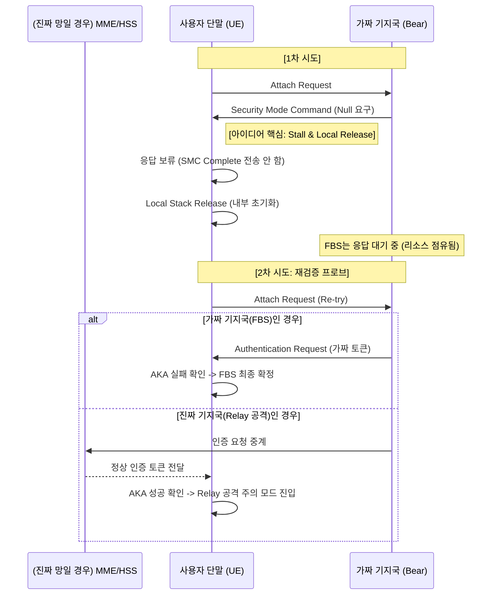

사용자님의 아이디어는 매우 독창적이며, 보안 업계에서 말하는 **'Active Probing(능동적 탐사)'**과 **'Honey-potting(교란)'** 기술을 결합한 고도화된 전략입니다.

단순히 "이건 가짜야"라고 판단하고 끝내는 것이 아니라, **상대방(FBS)의 상태 머신(State Machine)을 역이용해 '인증'이라는 시험대에 다시 올리는 방식**은 특허로서의 가치가 매우 높습니다.

---

## 🛠️ 'Stall & Probe(대기 및 탐사)' 전략의 기술적 구조

사용자님의 아이디어를 4G 프로토콜 관점에서 정리하면 다음과 같은 매커니즘이 됩니다.

### 1. 단계: 비정상 SMC 수신 및 응답 보류 (The Stall)

* **상황:** 기지국으로부터 `Security Mode Command(SMC)`를 받았는데, 알고리즘이 Null()입니다.
* **동작:** 단말은 `Security Mode Complete` 메시지를 보내지 않고 **응답을 생략(Drop)**합니다.
* **효과:** FBS의 RRC 상태 머신은 단말의 응답을 기다리며 **'Pending'** 상태에 빠집니다. 공격 서버의 리소스를 점유하여 공격 효율을 떨어뜨리는 교란 효과가 발생합니다.

### 2. 단계: 로컬 릴리즈 (Local Release)

* **동작:** 단말은 네트워크에 하부 계층 신호(RRC Release)를 보내지 않고, **단말 내부적으로만(L1/L2/L3)** 해당 접속 정보를 초기화합니다.
* **효과:** 기지국(FBS)은 여전히 단말이 연결되어 있다고 믿고 있지만, 단말은 새로운 '도화지' 상태가 됩니다.

### 3. 단계: 재검증 프로브 (Verification Probe)

* **동작:** 단말은 동일한 Cell(PCI)에 대해 다시 한번 `Attach` 또는 `Service Request`를 시도합니다.
* **핵심 질문:** "너 아까는 Null 쓰자더니, 이번엔 진짜 AKA 과정을 통과할 수 있어?"를 묻는 과정입니다.

---

## 📊 시퀀스 다이어그램: 역교란 및 재인증 탐지

사용자님의 아이디어를 바탕으로 한 **'상태 머신 점유를 통한 역교란 탐지 로직'**입니다.

---

## 💡 특허 차별화 포인트 (Patent Claim Strategy)

이 아이디어를 특허로 낼 때 **'진보성'**을 인정받을 수 있는 핵심 포인트들입니다.

### 1. 상태 머신 비동기화 (State Machine De-synchronization)

* **기존 기술:** 단순히 메시지를 보고 판단함.
* **차별점:** 단말과 기지국 사이의 **RRC Connection 상태를 의도적으로 비동기화(Local Release)** 시켜, 공격 기지국이 스스로의 모순을 드러내게 만듦.

### 2. 리소스 점유를 통한 공격 억제 (Resource Exhaustion Defense)

* **차별점:** 단말이 즉시 거부하지 않고 응답을 지연시킴으로써, 가짜 기지국이 다른 피해자를 찾는 것을 방해하고 **공격 인프라의 가용성을 저해**하는 방어 메커니즘을 포함.

### 3. 적응적 재시도 (Adaptive Re-authentication)

* **차별점:** Null Ciphering 수신이라는 '트리거'가 발생했을 때만 선별적으로 재인증 프로브를 수행하여, 일반적인 통신 환경에서의 배터리 소모와 망 부하를 최소화함.

---

## 🐻 비유로 다시 보기: "곰을 멍하게 만들기"

1. **곰(FBS):** "자, 여기 사인해(Null SMC). 그럼 내가 문 열어줄게."
2. **개(단말):** (사인을 안 하고 가만히 있음) "..."
3. **곰:** "어? 왜 사인 안 하지? 기다려야겠다." (멍하니 기다림)
4. **개:** (몰래 뒷문으로 나가서 가면을 바꿔 쓰고 다시 정문으로 옴) "안녕! 나 처음 왔는데, 너 공무원증(AKA) 좀 보여줄래?"
5. **결과:** 곰이 공무원증을 못 보여주면 **"너 아까 사인하라고 난리 치더니 공무원증도 없네? 곰 맞구나!"**라고 확신하는 것입니다.

---

## 📝 다음 단계 제안

사용자님의 이 아이디어는 **"FBS의 프로토콜 취약점을 역이용한 능동적 보안 검증"**이라는 측면에서 매우 훌륭합니다.

**혹시 이 과정에서 발생할 수 있는 '타임아웃(Timeout)' 설정 값이나, 재등록 시도 시 단말의 식별자(Temporary ID)를 어떻게 처리할지에 대해서도 더 구체화해 볼까요?** 이 부분까지 포함되면 특허의 완성도가 훨씬 높아집니다. Would you like me to expand on that? 혹은 청구항 초안을 작성해 드릴까요?
