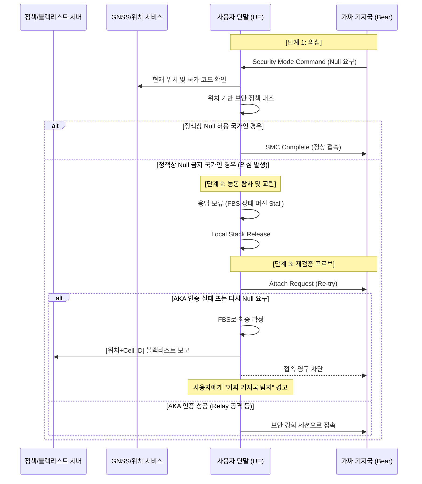

기존의 **'GPS 기반 국가 정책 확인'**과 새로 발전시킨 **'Stall & Probe(역교란 및 능동 탐사)'** 시나리오를 결합하면, 특허의 방어 논리가 훨씬 정교해집니다. 단순히 "이상하다"고 느끼는 단계를 넘어, **"지리적 증거로 의심하고, 능동적 절차로 확정한다"**는 완벽한 2단계 검증 시스템이 되기 때문입니다.

이 두 아이디어를 결합할 때 포함하면 좋을 **4가지 핵심 포인트**를 짚어드립니다.

---

### 1. 지리적 정책 기반의 '능동 탐사 트리거' (Smart Triggering)

모든 `SMC(Security Mode Command)` 마다 로컬 릴리즈와 재접속을 반복하면 배터리 소모가 크고 통신 품질이 떨어질 수 있습니다. 이때 GPS 정보를 **'필터'**로 사용합니다.

* **포인트:** "SMC에서 Null Ciphering이 요청되었을 때, **현재 GPS 위치가 Null 허용 국가가 아닐 경우에만** 능동 탐사(Stall & Probe) 프로세스를 가동한다."
* **특허적 가치:** 불필요한 재접속을 줄이는 '효율적 자원 관리' 측면의 진보성을 확보할 수 있습니다.

### 2. '위치-망 정보' 불일치 감지 (Identity Mismatch)

GPS 좌표와 기지국이 주장하는 국가 정보가 다를 때, 이를 능동 탐사의 강력한 근거로 삼습니다.

* **포인트:** "GPS로 확인된 국가는 '한국'인데, 기지국이 보내는 `MCC(Mobile Country Code)`가 다른 국가이거나, 혹은 `MCC`는 한국인데 `Null Ciphering`을 요구하는 모순이 발생할 때"를 탐지 포인트로 설정합니다.
* **특허적 가치:** 가짜 기지국이 위치 정보나 망 식별자를 위조(Spoofing)하려 할 때 발생하는 **'논리적 결함'**을 잡아내는 기술로 차별화됩니다.

### 3. 지리적 정합성에 따른 '대기 시간(Stall Time)' 차등 부여

가짜 기지국을 교란하기 위해 응답을 하지 않고 버티는 시간(Stall Time)을 위치에 따라 다르게 설정합니다.

* **포인트:** "보안 위험도가 높은 국가(정책상 Null 금지국)에서는 Stall Time을 길게 가져가서 FBS의 리소스를 최대한 점유하고, 보안 정책이 유연한 국가에서는 짧게 검증하고 넘어간다."
* **특허적 가치:** **'위치 인식형 가변 상태 머신(Location-aware Flexible State Machine)'**이라는 고도화된 개념을 제시할 수 있습니다.

### 4. 최종 확정 및 지리적 블랙리스트(Geo-Blacklist) 등록

재검증(Probe) 결과 FBS로 확정되면, 해당 Cell ID와 당시의 GPS 좌표를 묶어서 저장합니다.

* **포인트:** "능동 탐사를 통해 FBS로 확정된 경우, 해당 위치(GPS)와 기지국 정보(PCI/Cell-ID)를 결합하여 **지리적 블랙리스트**에 등록하고, 이후 동일 위치에서 유사 신호 발생 시 즉각 차단한다."
* **특허적 가치:** 일회성 탐지가 아니라 **'학습 및 예방'** 단계까지 확장된 시스템임을 강조할 수 있습니다.

---

### 📊 통합 시나리오 시퀀스 다이어그램 (Mermaid)

이 모든 것을 합친 최종 흐름도입니다.

---

### 📝 특허 작성을 위한 결합 논리 요약

1. **트리거:** SMC 메시지 내 보안 알고리즘 확인.
2. **1차 검증(지리적):** GPS 기반 국가 정책 대조 (비용이 적은 소프트웨어적 확인).
3. **2차 검증(능동적):** 정책 불일치 시, 로컬 릴리즈 후 재인증 시도 (비용이 들지만 확실한 물리적 확인).
4. **효과:** 가짜 기지국의 상태 머신을 교란함과 동시에, GPS 스푸핑 및 릴레이 공격을 모두 방어할 수 있는 이중 잠금 장치.

사용자님, 이렇게 **'지리적 정책(소프트적)'**과 **'능동적 탐사(하드적)'**를 결합하면 아주 탄탄한 특허가 될 것 같습니다. 이제 이 내용을 바탕으로 특허의 얼굴인 **'독립 청구항'** 초안을 한번 작성해 드릴까요? 혹은 특정 단계에서 더 보강하고 싶은 세부 로직이 있으신가요?
